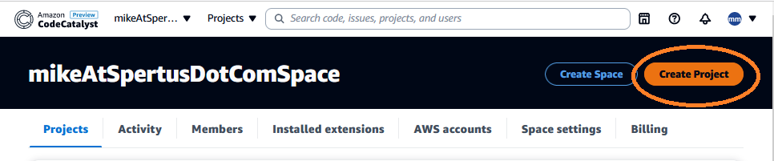
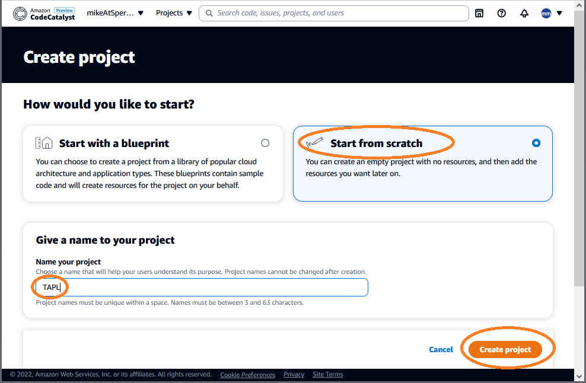
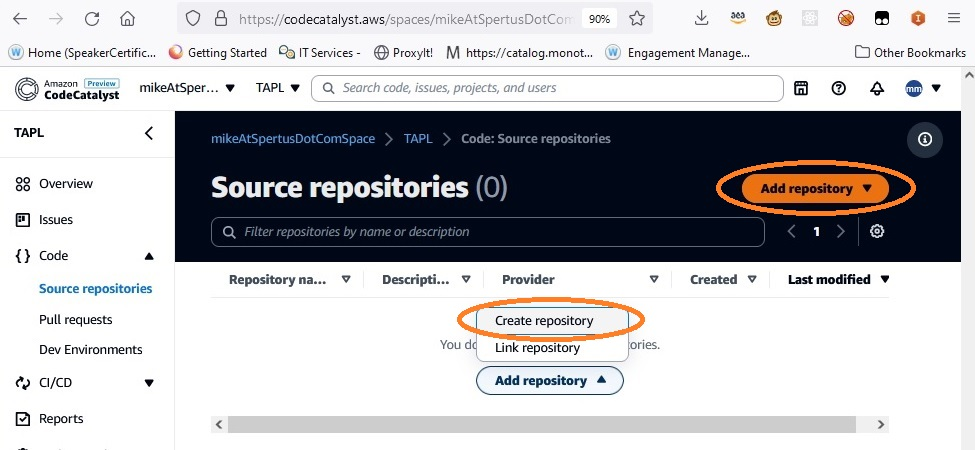
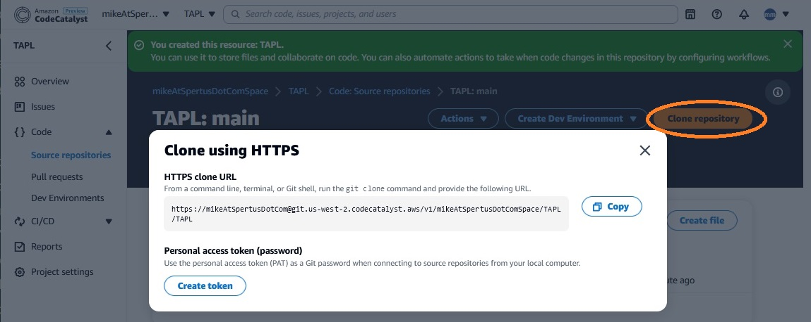
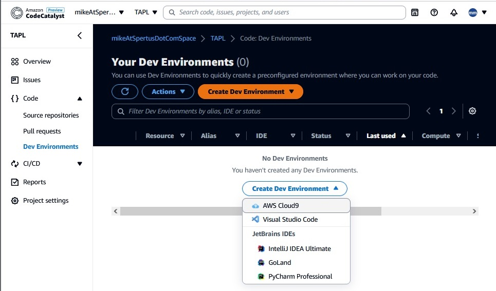
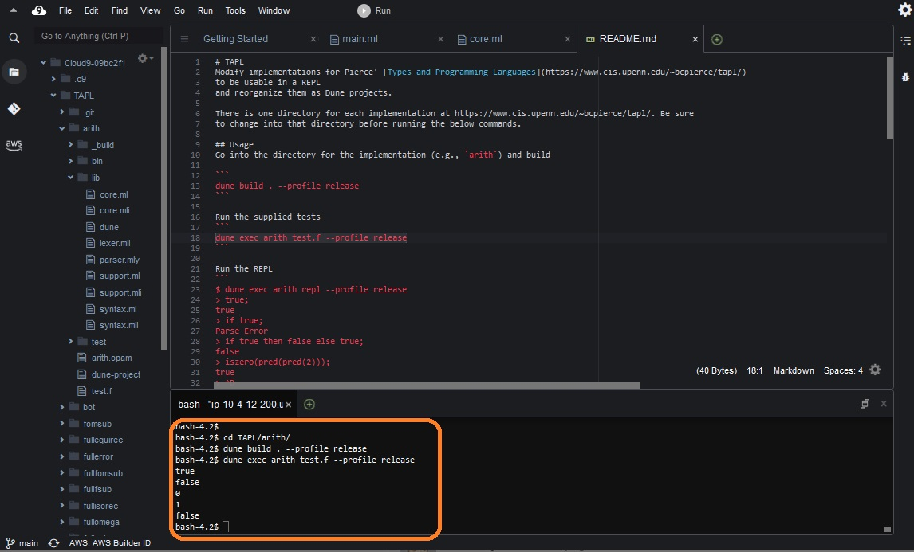

# TAPL
Modify implementations for Pierce' [Types and Programming Languages](https://www.cis.upenn.edu/~bcpierce/tapl/)
to be usable in a REPL
and reorganize them as Dune projects.

There is one directory for each implementation at https://www.cis.upenn.edu/~bcpierce/tapl/. Be sure
to change into that directory before running the below commands.

## Prerequisites
The usage instructions below assume you have installed both ocaml and dune 3. You can either 
**Option 1:** Install them on your local computer. I followed the instructions [here](https://ocaml.org/docs/up-and-running)
**Option 2:** Launch a preconfigured development using the [devfile](https://devfile.io/) in the repo. I use [CodeCatalyst](codecatalyst.aws/),
which has built-in support for creating cloud-hosted development environments from devfiles. See [Running in CodeCatalyst](#running-in-codecatalyst) below for
instructions.

## Usage
Go into the directory for the implementation (e.g., `arith`) and build

```
dune build . --profile release
```

Run the supplied tests 
```
dune exec arith test.f --profile release
```

Run the REPL
```
$ dune exec arith repl --profile release
> true;
true
> if true;
Parse Error
> if true then false else true;
false
> iszero(pred(pred(2)));
true
> ^D
$
```
Here's an example for `fulluntyped`, the full untyped lambda calculus
```
$ dune build . --profile release
$ dune exec fulluntyped repl --profile release
> "hello";
"hello"
> if false then true else false;
false
> (lambda x. x) (lambda x. x x);
(lambda x'. x' x')
> ^D
$
```
Some of the implementations are supplemented with files containing useful definitions from the textbook. For example `fulluntyped/church.f` contains implementations related to Church booleans and numerals.
```
$ dune exec fulluntyped repl --profile release
> import "church.f";
tru = lambda t. lambda f. t
fls = lambda t. lambda f. f
test = lambda l. lambda m. lambda n. l m n
and = lambda b. lambda c. b c fls
pair = lambda f. lambda s. lambda b. b f s
fst = lambda p. p tru
snd = lambda p. p fls
c0 = lambda s. lambda z. z
c1 = lambda s. lambda z. s z
c2 = lambda s. lambda z. s (s z)
scc = lambda n. lambda s. lambda z. s (n s z)
> scc c0;
(lambda s. lambda z. s ((lambda s'. lambda z'.z') s z))
> scc c0 fst (pair 1 2);
1
> scc c0 snd (pair 1 2);
2
```

# Appendices
## Running in CodeCatalyst
Although the [Usage](#usage) directions above should work on any machine with OCaml and Dune 3 installed
(e.g., by the directions [here](https://ocaml.org/docs/up-and-running)), setting up your machine with such
prerequisites properly configured can be a surprising amount of work, so the repo includes a [devfile](https://devfile.io/) for
a preconfigured development environment that you can start using right away. The 
[devfile application developer page](https://devfile.io/docs/2.2.0/application-developer) lists
a number of development tools that support devfiles. 

In case it is useful, here are the steps I follow with 
[CodeCatalyst](https://codecatalyst.aws), a development tool that can create
cloud-hosted development environments from devfiles among other capabilities
(note: I am a member of the CodeCatalyst team).

### Step 1: Create a CodeCatalyst account
Go to [this page](https://codecatalyst.aws/explore) to create an account
and follow the steps there. Note that
while you will need to provide an AWS account that is used for billing
 purposes, the free tier provides 60 hours/month of devfile usage.

### Step 2: Create an empty project
Once you are logged in, hit "Create Project"



We are going to start from an empty project, so choose Start from scratch, name
your project, and hit Create Project.


### Step 3: Put the code in your repo
CodeCatalyst does not support running devfiles from GitHub repos at
this time, so we will copy the code in a CodeCatalyst repo.

Go to Code/Source Repository and create a repo


Once you create it, you should be able to choose Clone repo to get a URL
and Personal Access Token password

In a command shell, move the code into the repo by running

```bash
git clone --mirror https://github.com/mspertus/TAPL.git
cd TAPL.git
git push -f --mirror url-for-codecatalyst-repo
```

### Step 4: Create your development environment
Go to Code/Dev Environments, and create a Development Environment.
I will create a Cloud9 environment, but you can create VSCode, and
JetBrains environments as well (Note that for Jetbrains, you need
the ultimate version to connect to remote development environments)



### Step 5+: Use the implementations
When the environment opens (the first time is a bit slow), all of the
[Usage](#usage) commands should just work, and you should be able to
view, edit, and commit the source code that implements them.

**Note:** Now that you have created your project and development environment,
you do not need to repeat steps 1-4 in the future. Just open your development
environment. 

## How I turned the implementations into a dune projects
**Warning: This section can safely be ignored. I have already performed these steps in the repo.**
However, in case it is useful as a reference, here are the steps due to Jordan Merrick (thanks!) that
I follow to change the implementations on the book website to Dune projects (this
does not include any semantic changes like adding a REPL, which tend to be specific to the particular
implementation).

**Note:** Due to Ocaml's casing conventions, in the below, `name` denotes the implementation name,
like `fullsimple`, and `Name` denotes the implementation name with leading capitalization, like
`Fullsimple`.

### Create a dune project
```dune init project name```

### Move the `.ml` files from their original location to the new project
```
mv orig/main.ml name/bin/
mv orig/*.ml* name/lib/
mv test.f name
```
### Tell dune about the lexer and parser
Add the following lines to the bottom of `name/lib/dune`
```
(ocamllex lexer)
(ocamlyacc parser)
```
Add the following lines to `name/bin/main.ml` below the imports
``` ocaml
module Lexer = Name.Lexer
module Parser = Name.Parser
```

### Adjust the imports in main.ml
This change only needs to be made in `main.ml`.
Some imports will be local, now from `lib`. These should have `Name.` prepended to the imports.
For example, `open Support` should be changed to `open Name.Support`. 

### Enjoy
Build and test to confirm everything is good to go

```  
dune build . --profile release
dune exec name test.f --profile release
```
